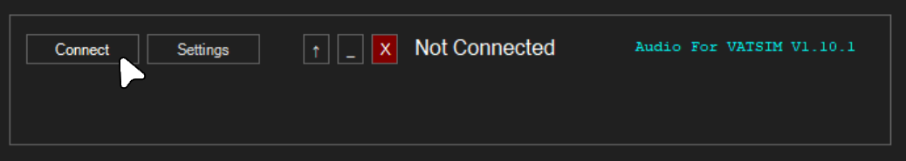
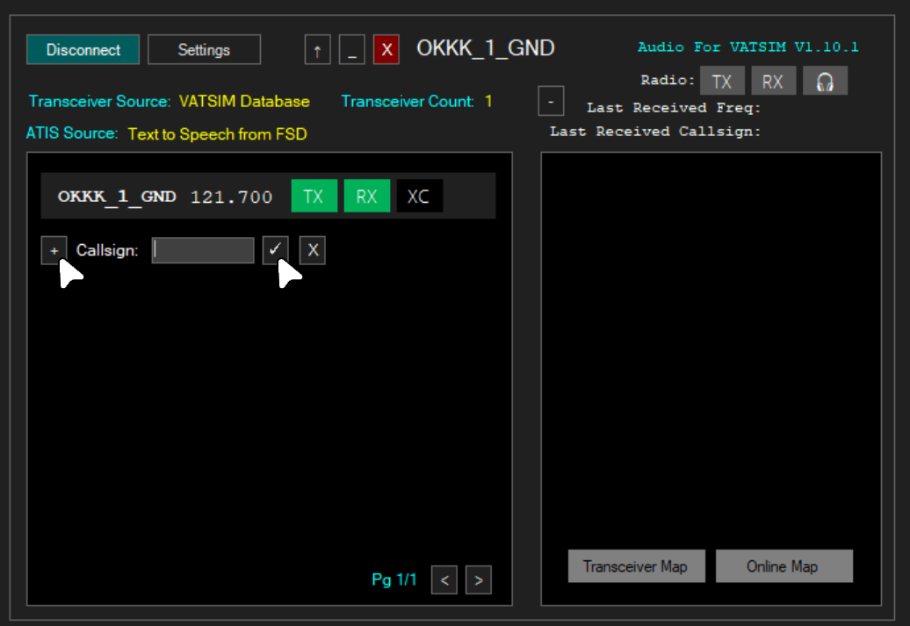
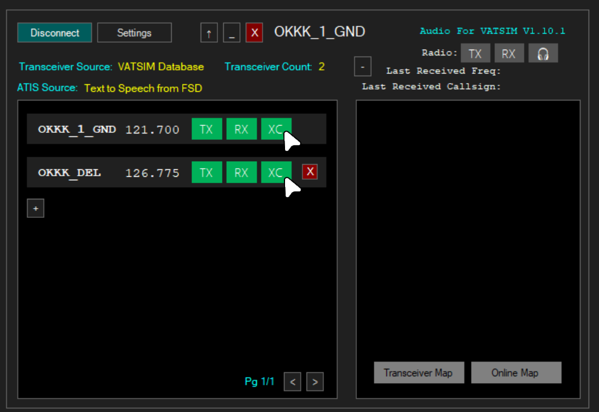
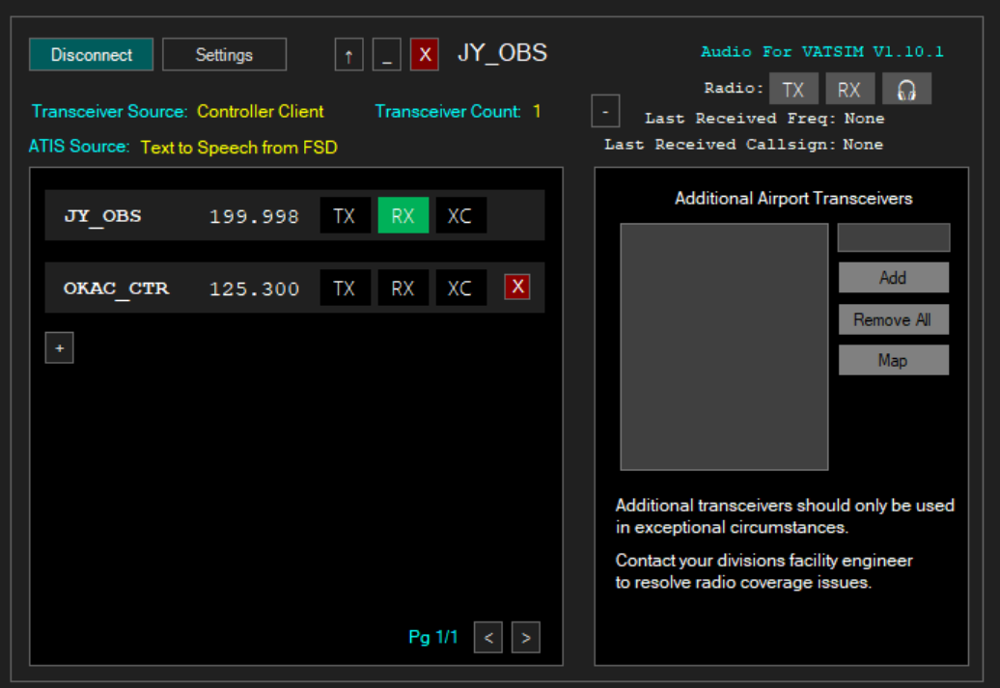
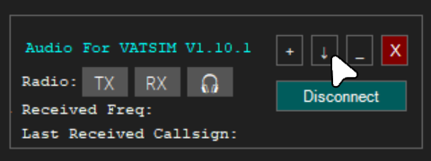

**Download Link:** [AFV Standalone Client](https://audio.vatsim.net/downloads/standalone "Direct download link")

!!! warning

    Note that Audio for VATSIM is **not** the recommended controller audio client; we recommend TrackAudio. A link to the TrackAudio guide can be found [here]

## What is Audio for VATSIM?
Audio for VATSIM (AFV) is VATSIM’s voice communication system that provides realistic radio simulation, including frequency tuning, radio range, and signal degradation. It improves voice clarity, reduces latency, and allows pilots and controllers to communicate more like real-world aviation.

## Setting up Audio for VATSIM

- Input your User Details
    * Your VATSIM CID
    * Your VATSIM Password
- Configure Audio Settings
    * Select a Microphone, Headset and an Optional Speaker device
- Adjust the Output and Mic volumes so that you can hear other pilots a controllers clearly, and that when speaking your volume bar is in the green zone.
- Set a PTT keybind
- Save your changes by clicking on 'Apply', then 'OK' on the bottom right

## Connecting and Transmitting on Frequency

- Open Audio for VATSIM, if setup correctly and connected to VATSIM you will be able to connect to AFV by pressing the 'Connect' button.

- By default, AFV will set you as TX on your primary frequency. If observering, see [below](#observing). 
- Click 'TX' to transmit on the frequency. You will need to use your PTT keybind to transmit; when transmitting the 'TX' button will be orange.

## Adding a new frequency

- To RX, TX or XC a different frequency, click the **+** button, type in the station callsign and then press the ✔ button.

## Cross-coupling a frequency

Cross-coupling allows transmissions, on more than 1 tranceiver to be re-emitted by other transceivers. See '[What is XC and XCA?](https://github.com/pierr3/TrackAudio#what-is-xc-and-xca "Opens in new tab"){target="_blank"} for more.

- To cross-couple a frequency, click on the 'XC' button next to frequencies you wish to cross-couple. You **must click the 'XC' button for all concerned frequencies.**

Click 'RX' to listen in the frequency.

## Observing

When connecting to AFV as an observer, you will be set to RX on your primary frequency (which should be 199.998).
To add a different frequency, click the **+** button, type in the station callsign and then press the ✔ button.
To then listen on the frequency, click on the 'RX' button.

## Extras

Audio for VATSIM also offers a 'mini-mode'. This forces the client to the front of your screen, and minimises the information shown.
To enable this, click on the ↑ button on the top of the client.

Still having issues with TrackAudio? Feel free to ask for help in one of our channels in the Gulf vACC Discord server which can be found in the [VATSIM Community Hub](https://community.vatsim.net/ "Opens in new tab"){target="_blank"}.